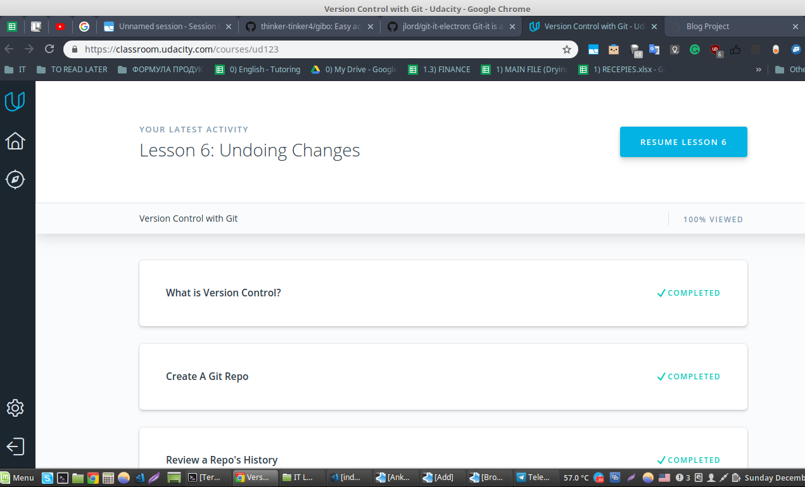
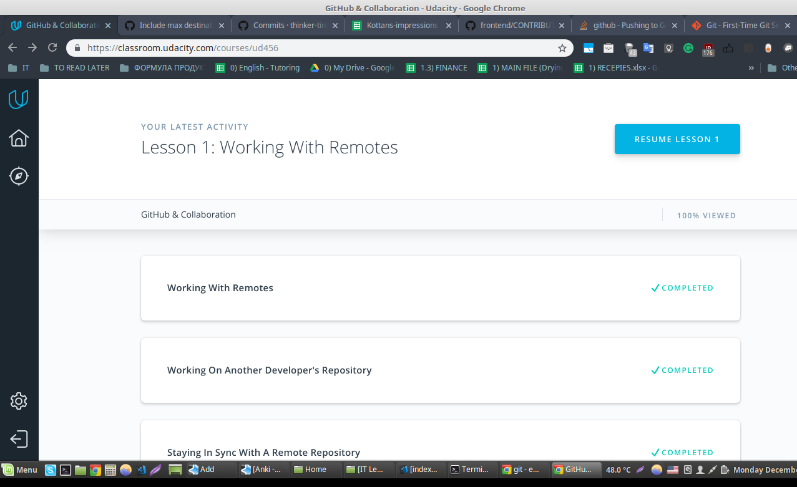

## Git Collaboration
*name (at least) one thing that was new to you*  
I knew about "git log" command, but now I know about its flags (-p, --stat); also this command - git shortlog -s -n

*name (at least) one thing that surprised you*  
the adviсe how to write commit messages and when it's better to commit. Now it makes more sense and I find it very helpful

*name (at least) one thing you intend to use in the future*  
pretty much everything

