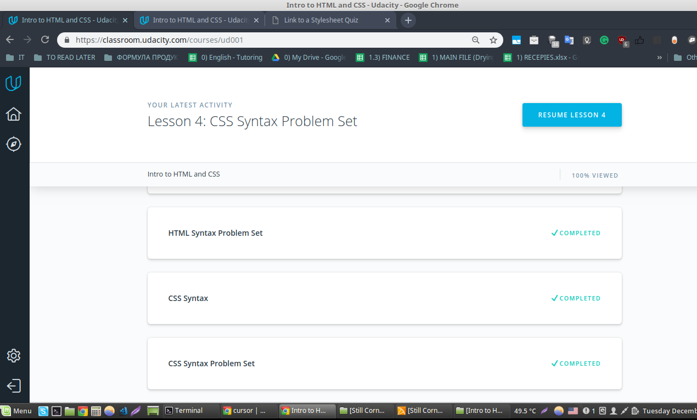
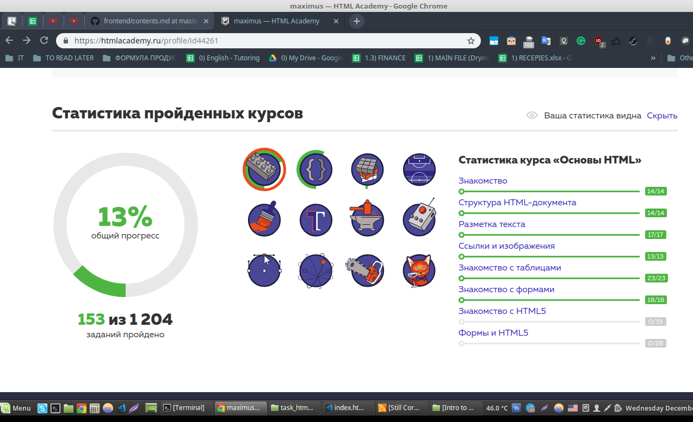
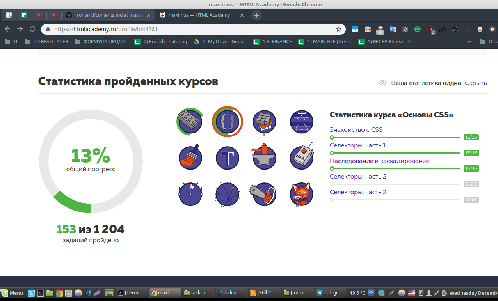

## Intro to HTML and CSS
*name (at least) one thing that was new to you*  
About the udacity course - all the material I've passed there wasn't new for me, yet it was good to refresh my knowledge; HTMLacademy - I learned a few things about specificity, and now I feel that I need to google a cheatsheet - table of specificity, I learned about different methods to choose or specify a selector, (e.g. div > p).

*name (at least) one thing that surprised you*  
The last tasks from HTML academy were surprisingly brain "digging".

*name (at least) one thing you intend to use in the future*  
I've realised, that I need to practise a lot and regularly, it easily gets forgotten if I don't practise all the CSS stuff, selectors, all the ways I can specify them.

