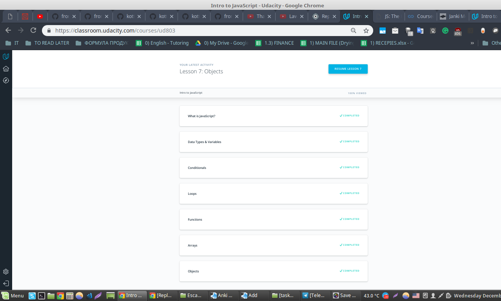
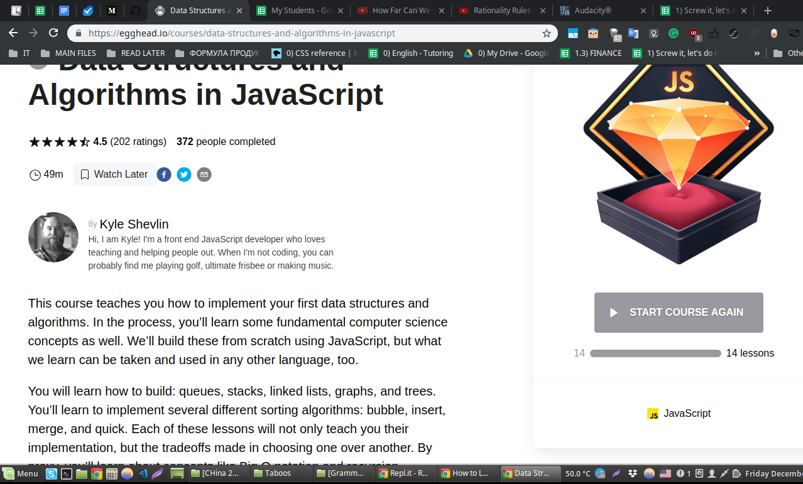
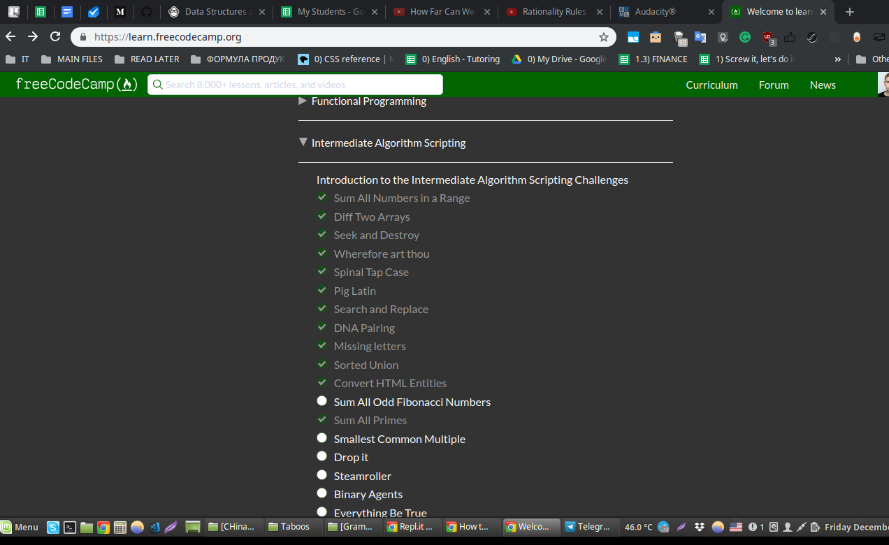

## JS Basics
*name (at least) one thing that was new to you*  
In the Data Structures and Algorithms in JavaScript course on egghead site, a lot of things were new to me. Before that I heard that all this stuff is being used in CScience and JS, yet - I think, I need to practise algorithms to find real cases how they are being used.

*name (at least) one thing that surprised you*  
in the Data Structures and Algorithms in JavaScript course on egghead site, the author is not using semicolons in his code. That surprised me a bit.

*name (at least) one thing you intend to use in the future*  
Everything will be used, cause it's basics.

