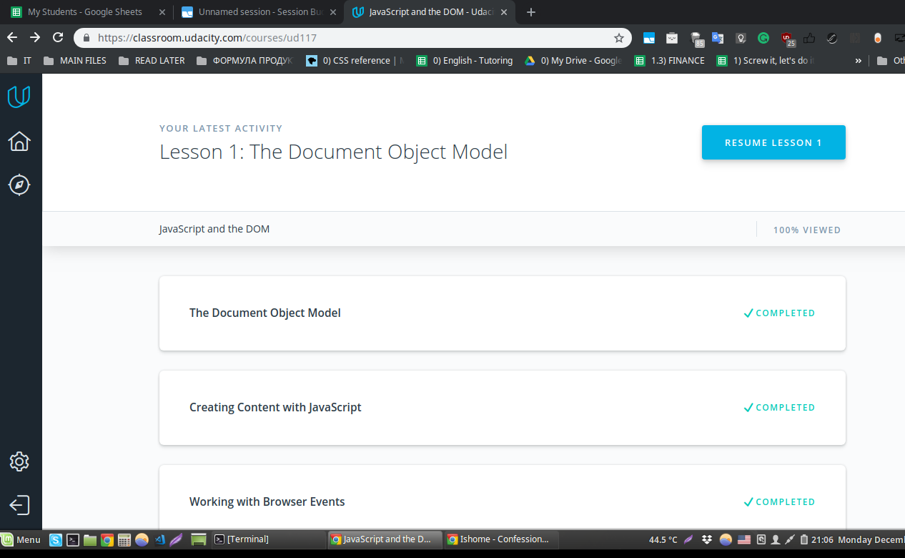
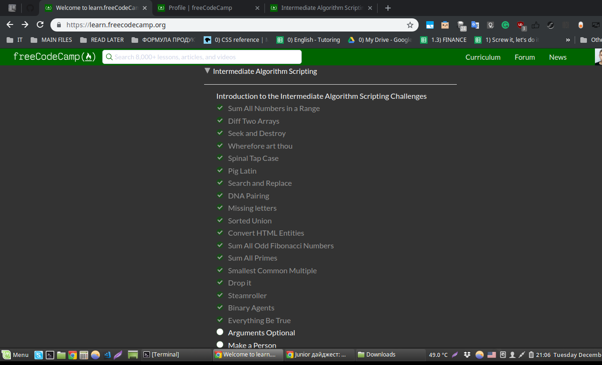

## DOM
*name (at least) one thing that was new to you*  
I learned new CSS techniques how to create beautiful styles for side-bar

*name (at least) one thing that surprised you*  
The second part of the freecodecamp algorithms seemed easier than the first. Neverthless I spent a great deal of time trying to solve.

*name (at least) one thing you intend to use in the future*  
I will use all the Array methods I've encountered while solving the tasks

