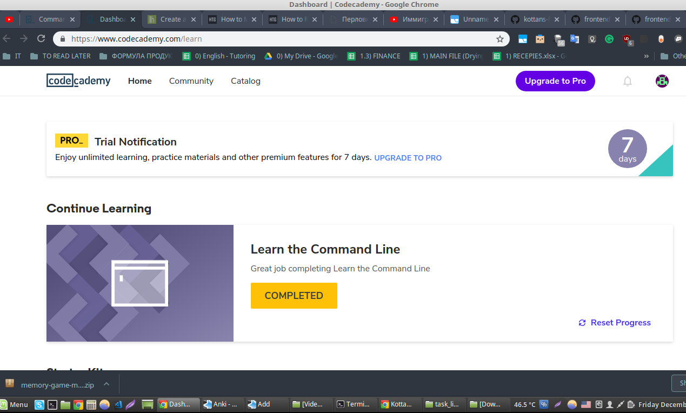
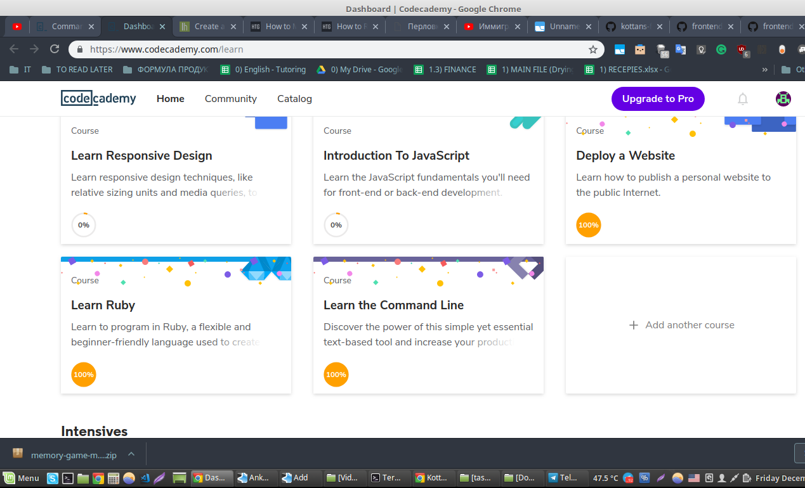

## Linux CLI, and HTTP
*name (at least) one thing that was new to you*  
I've learned lots of new commands. I use Linux Mint on a daily basis, and when passing a web-development tutorial I sometimes use the terminal, so after the mini-course, I will use the new commands that I've learned.

*name (at least) one thing that surprised you*  
The environmental variables, also I can change the color of the working folder when I'm using terminal.

*name (at least) one thing you intend to use in the future*  
Definitely I will use the new commands.

