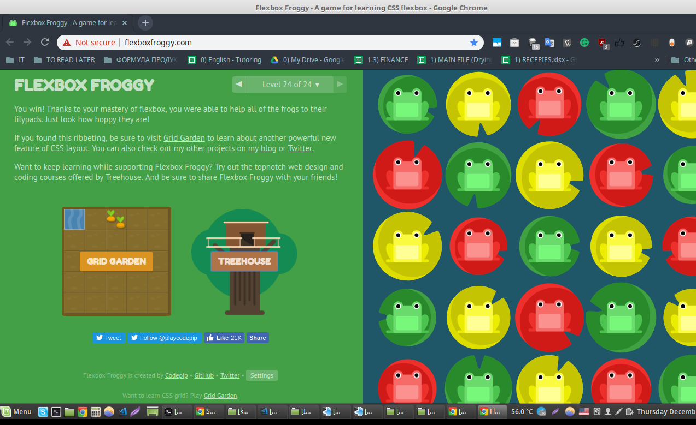
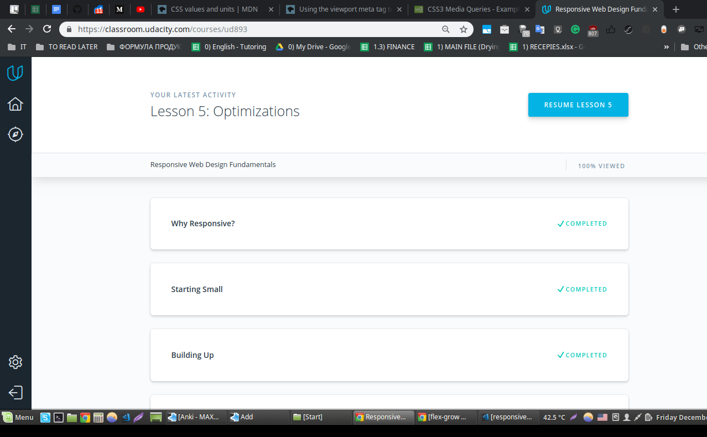

## Responsive Web Design
*name (at least) one thing that was new to you*  
DIPs (device independent pixels), never knew about the thing; order: 1.

*name (at least) one thing that surprised you*  
The thing that surprised me is that the space between buttons should be no less than 40 pixels at least, so that user's finger wouldn't touch two buttons

*name (at least) one thing you intend to use in the future*  
CSS grids, flexbox, media queries - that's for sure, I will use it

